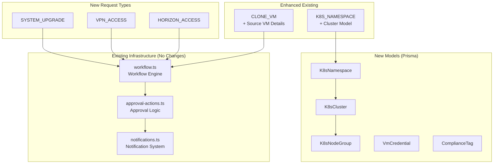
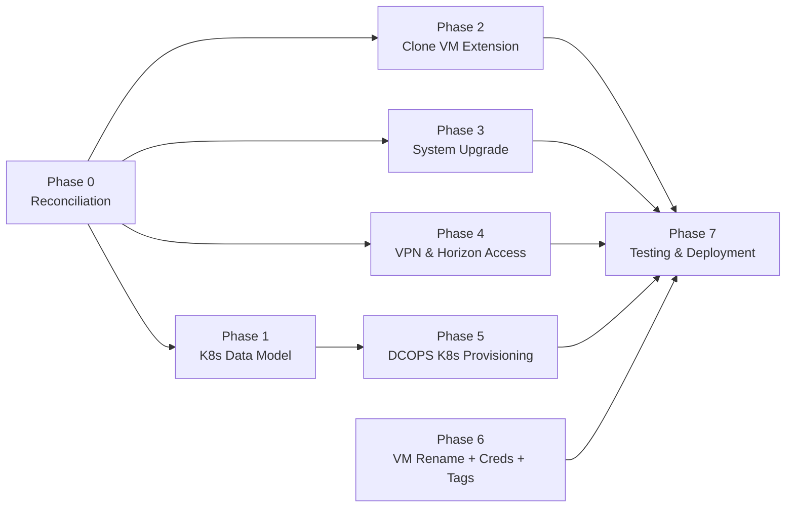
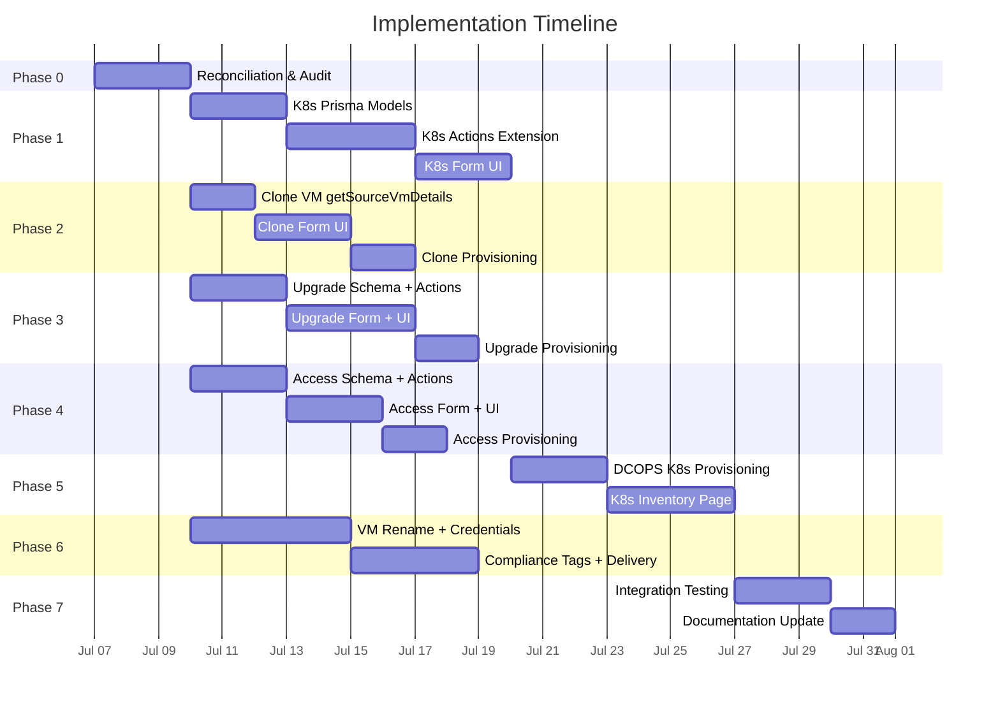

# VM Requisition System Enhancement — Implementation Plan & Workflow

> **Synthesized from:** [SYSTEM_DOCUMENTATION.md](file:///d:/datacenter/SYSTEM_DOCUMENTATION.md), [VM_CLONE_K8S_REVISED_PLAN_v2.md](file:///d:/datacenter/VM_CLONE_K8S_REVISED_PLAN_v2.md), and [.graphify analysis](file:///d:/datacenter/.graphify/GRAPH_REPORT.md)
> **Timeline:** 8 weeks · 8 phases
> **Platform:** Next.js 14 (App Router) + PostgreSQL + Prisma + Redis + MinIO

---

## Context & Problem Statement

The MIS Datacenter Portal currently supports 7 request types (`NEW_VM`, `CLONE_VM`, `K8S_NAMESPACE`, `VIRTUAL_IP`, `CUSTOMIZED`, `RENEWAL`, `DECOMMISSION`), but several workflows are incomplete or shallow. The v2 plan, reconciled against the `.graphify` codebase analysis (1171 nodes, 2926 edges, 69 communities), revealed:

- **Incomplete K8s flow** — `k8s-actions.ts` only exports `createK8sNamespaceRequest()`, no cluster/node-group model
- **Missing clone helper** — `getSourceVmDetails()` is not in `clone-actions.ts`
- **3 entirely absent request types** — `SYSTEM_UPGRADE`, `VPN_ACCESS`, `HORIZON_ACCESS`
- **No data models** for `K8sCluster`, `K8sNodeGroup`, `VmCredential`, `ComplianceTag`
- **Missing features** — VM rename, expected delivery date, credential management

---

## User Review Required

> [!IMPORTANT]
> **Open Questions — answers affect implementation scope:**
>
> 1. Does `VmInstance` need its own `systemName` field independent of `Request.systemName` for post-provisioning rename?
> 2. For VPN access provisioning — does DCOPS enter credentials into the system, or just confirm externally?
> 3. Does "under existing namespace" for K8s cluster reuse require re-approval, or just DCOPS execution?
> 4. Should `SYSTEM_UPGRADE` requests show a diff (old spec → new spec) in the approver view, or just the requested new spec?

> [!WARNING]
> **Breaking Change Risk:** Adding `SYSTEM_UPGRADE`, `VPN_ACCESS`, `HORIZON_ACCESS` to the Prisma `RequestType` enum requires a database migration. Existing data is safe (additive only), but the migration must run before the new code deploys.

---

## Architecture Overview



---

## Dependency Map (Build Order)



> **Key:** Phases 1–4 can run in parallel after Phase 0. Phase 5 depends on Phase 1 (K8s model). Phase 7 depends on all prior.

---

## Confirmed Existing (No Changes Needed)

| Item | File | Status |
|---|---|---|
| Clone request entry point | [clone-actions.ts](file:///d:/datacenter/src/app/actions/clone-actions.ts) | `createCloneRequest()` ✅ |
| K8s request entry point | [k8s-actions.ts](file:///d:/datacenter/src/app/actions/k8s-actions.ts) | `createK8sNamespaceRequest()` ✅ |
| VIP request entry point | [vip-actions.ts](file:///d:/datacenter/src/app/actions/vip-actions.ts) | `createVirtualIpRequest()` ✅ |
| RequestType enum (existing values) | [enums.ts](file:///d:/datacenter/src/types/enums.ts) | 7 types present ✅ |
| Workflow engine | [workflow.ts](file:///d:/datacenter/src/lib/workflow.ts) | Full helper set ✅ |
| Approval generation | [approval-actions.ts](file:///d:/datacenter/src/app/actions/approval-actions.ts) | `generateApprovals()` ✅ |
| Notification dispatch | [notifications.ts](file:///d:/datacenter/src/lib/notifications.ts) | All notify functions ✅ |

---

## Proposed Changes

---

### Phase 0: Reconciliation & Code Audit (Days 1–3)

**Goal:** Deep-read every file we'll touch, map current behavior, confirm assumptions before writing code.

#### Tasks

- [ ] Read [clone-actions.ts](file:///d:/datacenter/src/app/actions/clone-actions.ts) end-to-end — confirm `createCloneRequest()` signature, find what `getSourceVmDetails()` should return
- [ ] Read [k8s-actions.ts](file:///d:/datacenter/src/app/actions/k8s-actions.ts) end-to-end — confirm `createK8sNamespaceRequest()` scope, identify extension points
- [ ] Read [vip-actions.ts](file:///d:/datacenter/src/app/actions/vip-actions.ts) — confirm VIP provisioning completeness
- [ ] Read [RequestForm.tsx](file:///d:/datacenter/src/app/requests/components/RequestForm.tsx) — which request types have UI sections built
- [ ] Read [ProvisionVMModal.tsx](file:///d:/datacenter/src/app/approvals/components/ProvisionVMModal.tsx) and [VmExecutionModal.tsx](file:///d:/datacenter/src/app/approvals/components/VmExecutionModal.tsx) — provisioning path coverage
- [ ] Read [workflow.ts](file:///d:/datacenter/src/lib/workflow.ts) — map `DEFAULT_WORKFLOW_CONFIG` to confirm shared vs. per-type configs
- [ ] Read [schema.prisma](file:///d:/datacenter/prisma/schema.prisma) — full current schema to plan migrations
- [ ] Document findings as a reconciliation artifact

#### Deliverables

No code changes. Produces a reconciliation report confirming exact extend-points.

---

### Phase 1: K8s Cluster Data Model (Week 1–2)

**Goal:** Build the complete Kubernetes cluster model and extend the K8s request workflow.

---

#### [MODIFY] [schema.prisma](file:///d:/datacenter/prisma/schema.prisma)

Add 3 new models and 1 new enum:

```prisma
model K8sNamespace {
  id           String       @id @default(uuid())
  name         String       @unique
  supervisorIp String
  clusters     K8sCluster[]
  createdAt    DateTime     @default(now())
}

model K8sCluster {
  id           String         @id @default(uuid())
  namespaceId  String
  namespace    K8sNamespace   @relation(fields: [namespaceId], references: [id])
  requestId    String?
  clusterName  String
  username     String?
  totalSpaceGb Int?
  status       VmStatus       @default(ACTIVE)
  createdAt    DateTime       @default(now())
  nodeGroups   K8sNodeGroup[]
}

model K8sNodeGroup {
  id         String      @id @default(uuid())
  clusterId  String
  cluster    K8sCluster  @relation(fields: [clusterId], references: [id])
  role       K8sNodeRole
  nodeCount  Int
  vcpu       Int
  ramGb      Int
  isClonable Boolean     @default(true)
}

enum K8sNodeRole {
  MASTER
  WORKER
}
```

Extend `Request` model with:
```prisma
  underExistingNamespace   Boolean    @default(false)
  existingNamespaceId      String?
```

#### [MODIFY] [enums.ts](file:///d:/datacenter/src/types/enums.ts)

Add TypeScript enum values to match Prisma:
```typescript
// Add to RequestType enum (Phase 3-4 additions listed here for reference)
SYSTEM_UPGRADE = "SYSTEM_UPGRADE"
VPN_ACCESS     = "VPN_ACCESS"
HORIZON_ACCESS = "HORIZON_ACCESS"

// New enum
export enum K8sNodeRole {
  MASTER = "MASTER",
  WORKER = "WORKER",
}
```

#### [MODIFY] [k8s-actions.ts](file:///d:/datacenter/src/app/actions/k8s-actions.ts)

Add new exports:
- `createK8sCluster(data)` — creates cluster + node groups from request
- `cloneNodeGroup(nodeGroupId)` — duplicates a node group row (editable copy)
- `updateNodeGroup(id, data)` — only allowed while parent request is `DRAFT`
- `getNamespaceOptions()` — returns existing namespaces for dropdown

#### [MODIFY] [RequestForm.tsx](file:///d:/datacenter/src/app/requests/components/RequestForm.tsx)

Add K8s request form section:
- Master/worker node group editor (count, CPU, RAM, "+ Clone" per group)
- Total space field
- Existing-namespace dropdown (calls `getNamespaceOptions()`)
- Subdomain, system name, developer info fields
- Draft-save: node groups remain editable while `Request.status = DRAFT`

---

### Phase 2: Clone VM Extension (Week 3)

**Goal:** Complete the Clone VM workflow with source VM selection and spec pre-fill.

---

#### [MODIFY] [clone-actions.ts](file:///d:/datacenter/src/app/actions/clone-actions.ts)

Add `getSourceVmDetails(vmId: string)`:
- Fetches VM spec (CPU, RAM, storage, OS, hostname) for form pre-fill
- Filters: requester can only see own VMs (match `ownerId` to session user)
- Returns: `{ id, hostname, ipAddress, systemName, currentSpec: { vcpu, ramGb, storageGb, osName, osVersion } }`

#### [MODIFY] [RequestForm.tsx](file:///d:/datacenter/src/app/requests/components/RequestForm.tsx)

Update clone form section:
- Source VM selector (filterable combobox, shows only requester's VMs)
- Auto-fill spec fields from `getSourceVmDetails()` response
- Editable system name field for the clone
- Disk copy confirmation checkbox

#### [MODIFY] [ProvisionVMModal.tsx](file:///d:/datacenter/src/app/approvals/components/ProvisionVMModal.tsx)

Extend to handle `CLONE_VM` type:
- Display source VM info alongside provisioning fields
- Add disk-clone action confirmation
- Show cloned VM details after provisioning

---

### Phase 3: System Upgrade Request (Week 4)

**Goal:** Add the `SYSTEM_UPGRADE` request type — end-to-end from form submission through approval to DCOPS execution.

---

#### [MODIFY] [schema.prisma](file:///d:/datacenter/prisma/schema.prisma)

Add upgrade fields to `Request` model:
```prisma
  upgradeVmId          String?    // FK → VmInstance being upgraded
  upgradeCpu           Int?       // requested new vCPU count
  upgradeRamGb         Int?       // requested new RAM (GB)
  upgradeStorageGb     Int?       // requested additional storage (GB)
  upgradeJustification String?    @db.Text
```

Add `SYSTEM_UPGRADE` to Prisma `RequestType` enum.

#### [NEW] [upgrade-actions.ts](file:///d:/datacenter/src/app/actions/upgrade-actions.ts)

New server action file:
- `createSystemUpgradeRequest(data)` — validates, creates Request with type `SYSTEM_UPGRADE`, calls `generateApprovals()`
- `getUpgradeableVms(userId)` — returns requester's active VMs eligible for upgrade
- Pattern: follows same structure as [clone-actions.ts](file:///d:/datacenter/src/app/actions/clone-actions.ts) (auth check → validate → create → approve → notify)

#### [NEW] [upgrade/page.tsx](file:///d:/datacenter/src/app/requests/upgrade/page.tsx)

New page route `/requests/upgrade`:
- VM selector (own active VMs only)
- Current spec display (read-only)
- New spec inputs (CPU, RAM, storage) with delta preview
- Justification text area
- Standard submit flow → enters approval workflow

#### [MODIFY] [ProvisionVMModal.tsx](file:///d:/datacenter/src/app/approvals/components/ProvisionVMModal.tsx)

Add `SYSTEM_UPGRADE` handling:
- Display current vs. requested spec delta
- DCOPS confirms upgrade applied
- On execution: create new `VmSpec` row, update `VmInstance.currentSpecId`

#### [MODIFY] [Sidebar.tsx](file:///d:/datacenter/src/components/Sidebar.tsx)

Add navigation entry for System Upgrade under Requests section (role-gated to `REQUESTER` / `ADMIN`).

---

### Phase 4: VPN & Horizon Access Requests (Week 5)

**Goal:** Add `VPN_ACCESS` and `HORIZON_ACCESS` request types with shared action file.

---

#### [MODIFY] [schema.prisma](file:///d:/datacenter/prisma/schema.prisma)

Add to `Request` model:
```prisma
  accessTargetVmId    String?
  accessType          AccessType?
  accessJustification String?    @db.Text
```

Add new enum and values:
```prisma
enum AccessType {
  VPN
  HORIZON
}
```

Add `VPN_ACCESS`, `HORIZON_ACCESS` to Prisma `RequestType` enum.

#### [MODIFY] [enums.ts](file:///d:/datacenter/src/types/enums.ts)

```typescript
export enum AccessType {
  VPN = "VPN",
  HORIZON = "HORIZON",
}
```

#### [NEW] [access-actions.ts](file:///d:/datacenter/src/app/actions/access-actions.ts)

New server action file:
- `createVpnAccessRequest(data)` — creates Request with `VPN_ACCESS` type
- `createHorizonAccessRequest(data)` — creates Request with `HORIZON_ACCESS` type
- `getAccessibleVms(userId)` — returns requester's VMs eligible for access requests
- Pattern: same auth → validate → create → approve → notify flow

#### [NEW] [access/page.tsx](file:///d:/datacenter/src/app/requests/access/page.tsx)

New page route `/requests/access`:
- VM selector (own VMs)
- Access type radio: VPN | Horizon
- Justification text area
- Standard submit → approval workflow

#### [MODIFY] [ProvisionVMModal.tsx](file:///d:/datacenter/src/app/approvals/components/ProvisionVMModal.tsx)

Add `VPN_ACCESS` / `HORIZON_ACCESS` handling:
- Access provisioning modal (configure VPN credentials / Horizon desktop assignment)
- DCOPS confirms access provisioned

#### [MODIFY] [Sidebar.tsx](file:///d:/datacenter/src/components/Sidebar.tsx)

Add navigation entry for Access Request under Requests section.

---

### Phase 5: DCOPS K8s Provisioning + Inventory (Week 6)

**Goal:** Extend DCOPS provisioning to write K8s cluster data and build a K8s inventory page.

**Dependency:** Phase 1 (K8s data model must exist).

---

#### [MODIFY] [ProvisionVMModal.tsx](file:///d:/datacenter/src/app/approvals/components/ProvisionVMModal.tsx)

Extend K8s provisioning path:
- On `K8S_NAMESPACE` execution: write provisioning data (username, cluster name, supervisor IP, namespace name) into `K8sCluster` / `K8sNamespace` tables
- Show node group summary during provisioning

#### [NEW] [k8s/page.tsx](file:///d:/datacenter/src/app/inventory/k8s/page.tsx)

New inventory route `/inventory/k8s`:
- Server component fetching K8s inventory data

#### [NEW] [K8sInventoryClient.tsx](file:///d:/datacenter/src/app/inventory/k8s/components/K8sInventoryClient.tsx)

Hierarchy view: Supervisor IP → Namespace → Cluster → Node Group
- Expandable tree/accordion UI
- Node group details (role, count, CPU, RAM, clonable status)
- Filter by namespace / supervisor IP
- Status badges per cluster

#### [MODIFY] [Sidebar.tsx](file:///d:/datacenter/src/components/Sidebar.tsx)

Add K8s Inventory navigation entry under Inventory section (role-gated to `DC_OPS` / `ADMIN`).

#### [MODIFY] [dashboard/dcopsDashboard.ts](file:///d:/datacenter/src/lib/dashboard/dcopsDashboard.ts)

Surface K8s clusters in DCOPS provisioning queue alongside VM requests.

---

### Phase 6: VM Rename + Credentials + Compliance Tags (Week 7)

**Goal:** Post-provisioning management features — rename, credential storage, compliance tagging, delivery date.

---

#### [MODIFY] [schema.prisma](file:///d:/datacenter/prisma/schema.prisma)

Add new models:
```prisma
model VmCredential {
  id           String   @id @default(uuid())
  vmInstanceId String
  vmInstance   VmInstance @relation(fields: [vmInstanceId], references: [id])
  username     String
  password     String   // AES-256-CBC encrypted
  service      String?  // e.g., "SSH", "RDP", "Database"
  createdAt    DateTime @default(now())
  updatedAt    DateTime @updatedAt
}

model CredentialAccessLog {
  id             String   @id @default(uuid())
  credentialId   String
  accessedById   String
  accessedAt     DateTime @default(now())
  accessMethod   String   // "VIEW", "COPY", "EMAIL"
}

model ComplianceTag {
  id          String       @id @default(uuid())
  name        String       @unique
  description String?
  color       String?
  requests    RequestTag[]
}

model RequestTag {
  id        String        @id @default(uuid())
  requestId String
  tagId     String
  tag       ComplianceTag @relation(fields: [tagId], references: [id])
}
```

Add to `Request` model:
```prisma
  expectedDeliveryDate DateTime?
```

#### [MODIFY] [vm-management-actions.ts](file:///d:/datacenter/src/app/actions/vm-management-actions.ts)

Add `updateVmSystemName(vmId, newName)`:
- Owner or admin only
- Creates `AuditLog` entry
- Updates `VmInstance` system name

Add credential CRUD:
- `storeVmCredential(vmId, data)` — AES-256-CBC encrypt password (reuse pattern from [emailService.ts](file:///d:/datacenter/src/lib/admin/emailService.ts))
- `getVmCredentials(vmId)` — returns credentials (password masked unless user has access)
- `emailVmCredentials(vmId, recipientEmail)` — sends encrypted credentials via email

#### [MODIFY] [RequestForm.tsx](file:///d:/datacenter/src/app/requests/components/RequestForm.tsx)

Add `expectedDeliveryDate` date picker to all request type forms.

#### [MODIFY] [RequestList.tsx](file:///d:/datacenter/src/app/requests/components/RequestList.tsx)

Surface `expectedDeliveryDate` in the request list table.

---

### Phase 7: Testing & Deployment (Week 8)

**Goal:** Integration tests, permission tests, workflow tests, documentation.

---

#### Test Categories

| Category | Scope |
|---|---|
| **Integration Tests** | All new request types (`SYSTEM_UPGRADE`, `VPN_ACCESS`, `HORIZON_ACCESS`) end-to-end |
| **Permission Tests** | Requester can only upgrade/clone/access own VMs; DCOPS-only provisioning gates |
| **Workflow Tests** | All new types pass through correct approval chain (standard 4-level) |
| **Schema Migration** | Test migration on staging DB with production-like data |
| **UI Tests** | New form sections render correctly, validation works, error states display |
| **Provisioning Tests** | DCOPS execution modals for each new type create correct DB records |

#### Documentation

- Update [SYSTEM_DOCUMENTATION.md](file:///d:/datacenter/SYSTEM_DOCUMENTATION.md) with new request types, models, and endpoints
- Update Appendix A (enums) with `SYSTEM_UPGRADE`, `VPN_ACCESS`, `HORIZON_ACCESS`, `AccessType`, `K8sNodeRole`
- Update Appendix B (indexes) with new model indexes
- Re-run graphify to update the knowledge graph

---

## Complete File Impact Summary

### New Files (6)

| File | Phase |
|---|---|
| `src/app/actions/upgrade-actions.ts` | Phase 3 |
| `src/app/actions/access-actions.ts` | Phase 4 |
| `src/app/requests/upgrade/page.tsx` | Phase 3 |
| `src/app/requests/access/page.tsx` | Phase 4 |
| `src/app/inventory/k8s/page.tsx` | Phase 5 |
| `src/app/inventory/k8s/components/K8sInventoryClient.tsx` | Phase 5 |

### Modified Files (12)

| File | Phases | Changes |
|---|---|---|
| [schema.prisma](file:///d:/datacenter/prisma/schema.prisma) | 1, 3, 4, 6 | +3 K8s models, +2 credential models, +2 tag models, Request extensions, +3 enums |
| [enums.ts](file:///d:/datacenter/src/types/enums.ts) | 1, 3, 4 | +3 RequestType values, +K8sNodeRole, +AccessType |
| [k8s-actions.ts](file:///d:/datacenter/src/app/actions/k8s-actions.ts) | 1 | +4 functions (cluster CRUD) |
| [clone-actions.ts](file:///d:/datacenter/src/app/actions/clone-actions.ts) | 2 | +1 function (`getSourceVmDetails`) |
| [vm-management-actions.ts](file:///d:/datacenter/src/app/actions/vm-management-actions.ts) | 6 | +4 functions (rename, credential CRUD) |
| [RequestForm.tsx](file:///d:/datacenter/src/app/requests/components/RequestForm.tsx) | 1, 2, 6 | K8s section, clone source selector, delivery date |
| [ProvisionVMModal.tsx](file:///d:/datacenter/src/app/approvals/components/ProvisionVMModal.tsx) | 2, 3, 4, 5 | Handle CLONE_VM, SYSTEM_UPGRADE, VPN/HORIZON, K8s provisioning |
| [RequestList.tsx](file:///d:/datacenter/src/app/requests/components/RequestList.tsx) | 6 | Show expectedDeliveryDate column |
| [Sidebar.tsx](file:///d:/datacenter/src/components/Sidebar.tsx) | 3, 4, 5 | +3 nav entries (upgrade, access, K8s inventory) |
| [workflow.ts](file:///d:/datacenter/src/lib/workflow.ts) | 3, 4 | Add workflow configs for new request types (if not auto-covered by defaults) |
| [dcopsDashboard.ts](file:///d:/datacenter/src/lib/dashboard/dcopsDashboard.ts) | 5 | Surface K8s clusters in provisioning queue |
| [SYSTEM_DOCUMENTATION.md](file:///d:/datacenter/SYSTEM_DOCUMENTATION.md) | 7 | Update all sections with new capabilities |

### Files Unchanged (Confirmed)

| File | Reason |
|---|---|
| [approval-actions.ts](file:///d:/datacenter/src/app/actions/approval-actions.ts) | Generic approval logic already handles all request types |
| [notifications.ts](file:///d:/datacenter/src/lib/notifications.ts) | Notification dispatch is type-agnostic |
| [request-actions.ts](file:///d:/datacenter/src/app/actions/request-actions.ts) | Core CRUD already generic enough |
| [authOptions.ts](file:///d:/datacenter/src/lib/authOptions.ts) | Auth unchanged |
| All `components/ui/*` | Shadcn primitives unchanged |

---

## Risk Mitigation

| Risk | Mitigation |
|---|---|
| Schema migration on production DB | Test migration on staging with production dump first; all changes are additive (no column drops) |
| Phase parallelism conflicts on `schema.prisma` | Batch all schema changes into a single migration file per sprint, not per-phase |
| `ProvisionVMModal.tsx` becomes too large | Extract type-specific provisioning into sub-components (e.g., `K8sProvisionPanel`, `UpgradeProvisionPanel`) |
| Workflow config for new types | Verify `DEFAULT_WORKFLOW_CONFIG` in `workflow.ts` auto-applies the standard 4-level chain; if not, add explicit configs in Phase 3/4 |
| AES-256 key management for credentials | Reuse existing `EMAIL_ENCRYPTION_KEY` pattern from `emailService.ts`; document that a separate key should be used in production |

---

## Verification Plan

### Automated Tests

```bash
# After each phase, verify the build passes
npm run build

# Run Prisma migration on dev DB
npx prisma migrate dev --name phase_X_description

# Verify schema is in sync
npx prisma validate

# Check workflow configuration
npx tsx scripts/check-workflows.ts
```

### Manual Verification

| Phase | Verification |
|---|---|
| Phase 0 | Reconciliation report artifact reviewed |
| Phase 1 | Create K8s namespace request → see node group editor → save draft → edit groups → submit → approve |
| Phase 2 | Clone VM request → select source VM → see spec pre-fill → submit → approve → provision |
| Phase 3 | System upgrade request → select VM → set new spec → see delta → submit → approve → execute |
| Phase 4 | VPN/Horizon request → select VM → choose type → submit → approve → execute |
| Phase 5 | Visit `/inventory/k8s` → see hierarchy view → verify provisioned clusters appear |
| Phase 6 | Rename VM → verify audit log; store credential → retrieve (masked); add compliance tag |
| Phase 7 | Full regression of all 10 request types; permission matrix spot-checks |

---

## Execution Workflow


